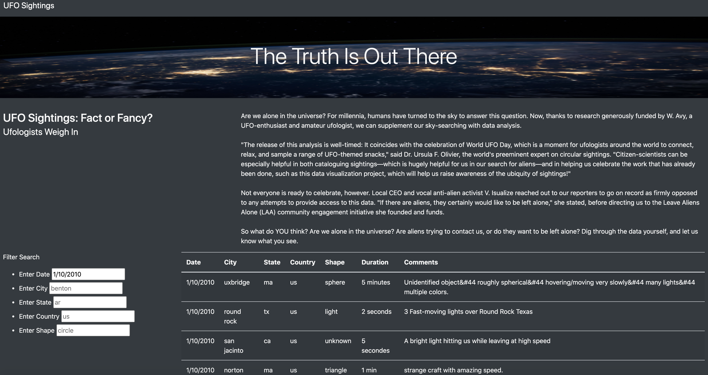
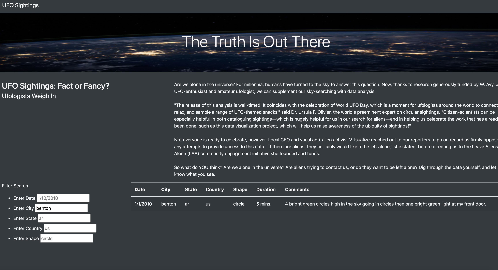

# UFOS
##Overview of Project: Explain the purpose of this analysis.
-The purpose of this analysis was to add multiple filters to a user-interactive webpage where users can screen ufo sightings by date, city, state, country, or shape. The webpage was css-customized to look professional, and results were screened when users typed in the screening criteria in the text box.

##Results: Describe to Dana how someone might use the new webpage by walking her through the process of using the search criteria. 
##Use images of your webpage during the filtering process to support your explanation.

-To use the webpage, the user enters in the search criteria in the text box. UFO sightings filtered by the criteria will then appear in the table next to it.

-Sample output filtered by date (1/10/2010):

-Sample output filtered by city (benton):

##Summary: In a summary statement, describe one drawback of this new design and two recommendations for further development

-A drawback of this design is that it doesnt have a "filter" button to make it clear to the user when the filtering starts.

-Recommendations for further development:
1) Include a filter button, where the user first types in the filters they want in the text boxes, and then the user can hit the "filter" button to actually do the filtering.
2) Include a "download" button where the user can download the results in a csv file.

